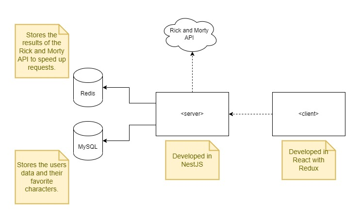

# Rick and Morty App

This project was built following the requirements provided by the [requirements document](./docs/Requirements.pdf).

## About the project

### Technical Considerations

- I used Typescript in the Backend and Javascript in the Frontend due to the fact that most of my experience on frontend development is in Javascript and I didn't want to spent a lot of time learning the nuances and patterns of React with Typescript.
- For tests I chose to implement `Unit Tests` in the Backend and `Integration Tests` in the Frontend due to time limitation and to showcase different strategies of testing.
- I created a `docker-compose` file to run MySQL and Redis containers since the Backend uses both so you don't have to install them on your machine if you have docker.

#### Backend

- The backend was developed using [Nest](https://nestjs.com/) a framework that runs on top of Express. It provides a project structure that I'm familiar with and a lot of the boilerplate that you have to create using vanilla Express is already provided by it. Also it is build and fully supports Typescript.

#### Frontend

- The frontend was developed using React and bootstrapped with [Create React App](https://github.com/facebook/create-react-app) using the Redux template. It wasn't developed using Typescript since I haven't had a lot of experience developing frontend projects with Typescript and since I only had a week to work on it I prioritized progress.

## Architecture



> Redis is used to store the results of requesting character pages to the Rick and Morty's API so future requests to the same pages could be sped up (for example the first page, that is the one that every user access first after login).


> A simple database to store users and their favorite characters.

## Frontend Design

I used Illustrator, Photoshop and XD to create a [wireframe](./docs/Wireframes.pdf) of how I wanted the Frontend to look and work, created the Login and Register pages on the fly.

The frontend have the following available pages.

```text
  Characters    ---> /              private
  Login         ---> /login         public
  Register      ---> /register      public
  404           ---> /*             public
```

## How to run the projects

1. Start by running the docker-compose file. `$ docker-compose up`
2. Once the containers are running follow the documentation inside each project's README.md

## Backend API Docs

I enable and documented the API using OpenAPI (Swagger). You can access it by by navigating to `localhost:4000/docs`.

> 4000 is the PORT used in the .env.example

If you have any questions or comments let me know.

Enjoy it!
